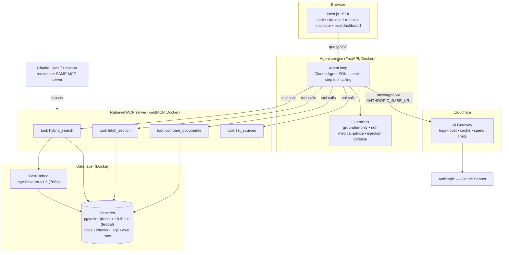
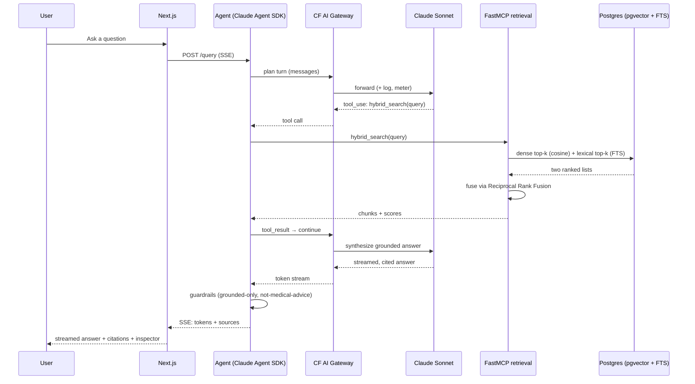

# Architecture

A multi-step, tool-calling agent over a hybrid-retrieval corpus. The retrieval MCP server
is standalone and reused by both the agent service and Claude Code (via `.mcp.json`).

## Components

- **apps/web** — Next.js 15 + TypeScript + Tailwind. Token-streaming chat with citation
  chips, a retrieval inspector (which tools fired + retrieved chunks + RRF score bars), a
  corpus sidebar with kind filter and upload, and the `/evals` dashboard. Talks to the
  agent over SSE.
- **services/agent** — FastAPI + Claude Agent SDK agent loop. Streams over SSE; owns the
  guardrails (grounded-only, not-medical-advice, prompt-injection defense) and the
  observability layer (OpenTelemetry spans, `structlog` with a `trace_id`, the `messages`
  table). LLM traffic routes through Cloudflare AI Gateway via `ANTHROPIC_BASE_URL`.
- **services/mcp** — FastMCP server exposing `hybrid_search`, `fetch_section`,
  `compare_documents`, `list_sources`. Owns ingestion (structure-aware chunking +
  FastEmbed `bge-base-en-v1.5` embeddings) and hybrid retrieval (pgvector dense + Postgres
  full-text, fused with Reciprocal Rank Fusion).
- **Postgres 16 + pgvector** — `documents`, `chunks` (dense `vector(768)` + `tsvector`),
  `messages`, `eval_runs` / `eval_results`.
- **evals** — golden set + runner (hit@k / MRR / nDCG + LLM-as-judge faithfulness), gated
  in CI and rendered on `/evals`.

## System

## Query path (agentic + hybrid)

