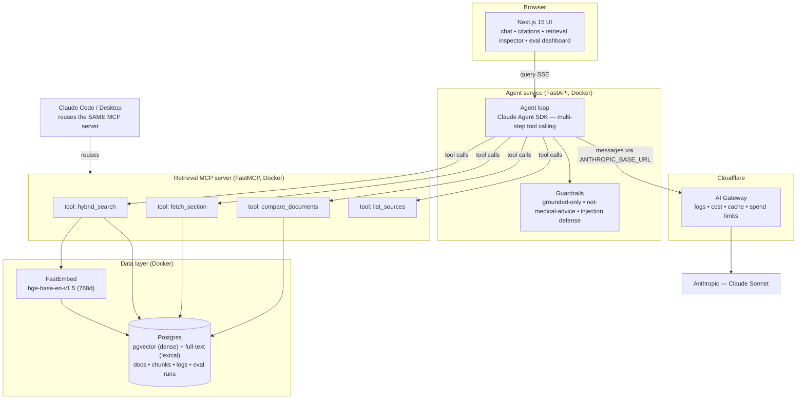
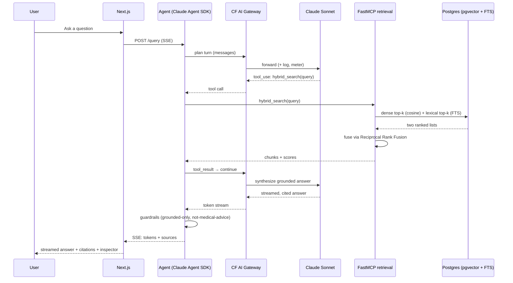

# NewPage Take-Home — Build Plan (v2, JD-aligned)

An **agentic** document-intelligence assistant, built to win the NewPage **AI-Native Builder / Forward Deployed Engineer** assignment.

> **The brief says it twice:** *"We value a solid & well-engineered basic solution A LOT MORE than an over-engineered complex one."* and *"We need your thoughts, not an LLM's direct output."*
>
> **The JD says, in effect:** treat AI as the substrate. Show **agents (not prompted models)**, **MCP/FastMCP**, **eval harnesses as a first-class discipline**, **hybrid retrieval**, and **production rigor (TDD, observability, CI/CD, secrets)** — with a **founder's mindset**. Bonus: **digital-health domain**.
>
> This plan is engineered against *both* documents at once: high-signal core, ruthlessly scoped, demonstrably agentic, deployed for real.

---

## 0. TL;DR — the headline decisions (revised after reading the JD)

| Decision | Choice | Why (for the README) |
|---|---|---|
| **Which option** | **Option 1 — Chat With Your Docs**, themed as a **digital-health document assistant** | Most flexible canvas; you pick the corpus → public health/life-sciences docs signal domain fit (a JD bonus); lets you showcase hybrid retrieval, evals, and health-grade guardrails. *(Career Intelligence was the wrong call once the JD revealed an agentic, health-domain role.)* |
| **Shape** | **Agent, not single-shot RAG** | The JD's #1 ask: *"agents, not just prompted models … wired tools to a model and let it run multi-step."* Build a tool-calling agent loop. |
| **Agent runtime** | **Claude Agent SDK** (Python) | Named explicitly in the JD; same loop that powers Claude Code; supports MCP, sub-agents, skills, hooks. On-brand and current. *(Own orchestration is an accepted alternative — note it as the senior-judgment variant.)* |
| **Tools** | **FastMCP server** exposing `hybrid_search`, `fetch_section`, `compare_documents`, `list_sources` | Hits MCP + FastMCP + custom connectors + *"wire up MCP servers"* in one move. **One server, two consumers:** the agent uses it *and* it drops into Claude Code/Desktop. This is your Microns Hub wheelhouse. |
| **Retrieval** | **Hybrid: dense (pgvector) + lexical (Postgres FTS) fused with Reciprocal Rank Fusion** | JD names *"BM25 + similarity search"* and Elasticsearch. pgvector + FTS + RRF is the right-sized answer with no extra infra — *"chosen for fit, not preference"* (their words). |
| **Evals** | **First-class harness** (golden set, hit@k/MRR/nDCG, faithfulness/groundedness, CI gating, report) | The single biggest differentiator for this role. *"Treat evals as a first-class discipline: hands-on harnesses, not theoretical frameworks."* |
| **LLM** | **Claude Sonnet** via **Cloudflare AI Gateway** | Logs, cost, caching, spend limits = the observability + cost story. Agent traffic routes through it via `ANTHROPIC_BASE_URL`. |
| **Embeddings** | **`bge-base-en-v1.5` local via FastEmbed (768d)** | No extra key, reproducible, free; same `bge` family as Cloudflare Workers AI → vectors stay compatible in prod. |
| **Stores** | Postgres + pgvector (local) → Vectorize + D1 + R2 (prod) | One mental model locally; clean Cloudflare migration. |

**The one thing I need from you:** confirm **Option 1, health-themed**. (Option 2 — Code Documentation Assistant — is the off-domain alternative if you'd rather; everything else in this plan stays identical.)

---

## 1. What we're building

An assistant where you ingest a small **public digital-health corpus** and ask grounded questions across it. Good, safe, public corpus choices (no PII):
- **Clinical-trial protocols / records** (e.g. ClinicalTrials.gov) — eligibility, endpoints, arms.
- **Drug product information** (EMA SmPCs / FDA labels) — indications, contraindications, dosing.
- **Public clinical guidelines** (e.g. NICE, WHO).

The assistant is an **agent** that, per question, decides which tools to call (multi-step):

1. **Chat** — *"What are the exclusion criteria in trial X?"*, *"Compare the contraindications of drug A vs drug B."* The agent runs `hybrid_search`, maybe `fetch_section` or `compare_documents`, then answers **only from retrieved context, with citations**.
2. **Retrieval inspector** — every answer expands to show the chunks + fusion scores + which tools fired. Trust feature *and* observability.
3. **Eval dashboard** — a page that renders the latest eval run (retrieval + faithfulness metrics) straight from the DB.

**Scope discipline:** Phase 3 is a fully working end-to-end submission on its own (working retrieval + grounded cited answer + minimal UI). Agentic tools, hybrid fusion, evals, and the dashboard are layered on top. **Ship the core, then enhance** — exactly what the brief rewards.

---

## 2. Architecture



**Query path (agentic + hybrid):**



### Why this shape (key technical decisions)
- **Agent + tools over single-shot RAG** because the JD is hiring for agents. Multi-step tool use also handles real questions better (*"compare X and Y"* needs two retrievals + a synthesis step).
- **Tools live in a standalone FastMCP server**, not buried in the app, so the *same* server powers the agent and is reusable from Claude Code via `.mcp.json`. That is the difference between *saying* you know MCP and *showing* it.
- **Hybrid retrieval** because dense-only misses exact terms (drug names, criteria codes) and lexical-only misses paraphrase. RRF fuses both cheaply.
- **Local `bge` ↔ prod Workers AI `bge`** keeps your vectors the same family in dev and prod — the Vectorize migration is real, not hand-wavy.

---

## 3. Tech stack & rationale

| Layer | Choice | One-line rationale |
|---|---|---|
| Frontend | **Next.js 15 + TypeScript + Tailwind + shadcn/ui** | Fast, distinctive, accessible UI; SSE-friendly; you know it cold. |
| Agent service | **Python 3.12 + FastAPI + Claude Agent SDK** | The agent loop the JD names; SSE streaming; typed. |
| Tools / MCP | **FastMCP** (HTTP transport) | Standalone, reusable MCP server; idiomatic Python. |
| Embeddings | **FastEmbed → `BAAI/bge-base-en-v1.5` (768d)** | Local, free, reproducible; prod-compatible with Workers AI. |
| Retrieval | **pgvector (dense) + Postgres FTS (lexical) + RRF** | Hybrid with no extra infra; ParadeDB `pg_search` / Elasticsearch noted as the heavier option. |
| Relational + vector | **Postgres** (local) / **Vectorize + D1** (prod) | Docs, chunks, logs, eval runs. |
| Object storage | local volume (dev) / **R2** (prod) | Source files; key stored in chunk metadata. |
| LLM | **Claude Sonnet** via **Cloudflare AI Gateway** | Quality + observability + spend control in one. |
| Evals | **hands-on harness** (custom + lightweight metrics) | First-class, CI-gated; the headline signal. |
| Observability | **OpenTelemetry tracing + structlog (JSON) + AI Gateway + in-app inspector** | Four layers, all the JD asks for. |
| Container | **Docker + docker-compose** (web, agent, mcp, db) | `docker compose up` = up and running. |
| Tests | **pytest (TDD) + Vitest/RTL + optional Playwright** | Tests-first; deterministic with a mocked LLM. |
| CI/CD | **GitHub Actions** | Lint, type-check, tests, evals, **SAST (semgrep/bandit) + dep audit**. |

---

## 4. Repo structure (GitHub)

```
health-docs-agent/            # pick your name
├── README.md                 # ← YOUR voice. The single most-judged file.
├── ARCHITECTURE.md           # diagrams + agent/tool/data flow
├── CLAUDE.md                 # how you drove Claude Code (commit it — it's evidence)
├── .mcp.json                 # so reviewers can load your MCP server in Claude Code
├── docs/
│   ├── ai-workflow.md        # workflows, sub-agents, skills, do's/don'ts
│   ├── evals.md              # eval methodology + how to read the report
│   └── decisions/            # short ADRs (hybrid retrieval, agent-vs-RAG, embeddings…)
├── docker-compose.yml        # web + agent + mcp + postgres(pgvector)
├── Makefile                  # make up / test / eval / seed / lint
├── .env.example              # every var documented; no secrets
├── .github/workflows/ci.yml  # lint + typecheck + pytest + vitest + evals + semgrep + audit
├── apps/
│   └── web/                  # Next.js 15
│       ├── app/              # /, /chat, /sources, /evals
│       ├── components/       # ChatPanel, RetrievalInspector, EvalDashboard, Uploader
│       └── lib/              # api client, SSE hook, shared types
├── services/
│   ├── agent/                # FastAPI + Claude Agent SDK
│   │   ├── app/
│   │   │   ├── main.py       # /health /ingest /query(SSE) /evals
│   │   │   ├── agent/        # agent loop, system prompt, tool wiring
│   │   │   ├── guardrails/   # grounded-only, not-medical-advice, injection
│   │   │   └── obs/          # OTel + structlog + trace_id middleware
│   │   └── tests/
│   └── mcp/                  # FastMCP retrieval server (the reusable bit)
│       ├── server.py         # tools: hybrid_search, fetch_section, compare, list
│       ├── ingest/           # loaders + structure-aware chunker + embedder
│       ├── retrieval/        # dense, lexical, RRF fusion
│       └── tests/
└── evals/
    ├── dataset/              # golden Q&A with expected source sections
    ├── run.py                # runs the set → metrics → writes eval_runs to DB
    └── metrics.py            # hit@k, MRR, nDCG, faithfulness (LLM-as-judge)
```

---

## 5. Cloudflare integration (real, not just prose)

### 5a. Live — Claude Sonnet behind AI Gateway
Create a gateway (dashboard → AI → AI Gateway). The agent loop routes through it by setting the Anthropic base URL — the Claude Agent SDK respects the same env var as the CLI:

```bash
# .env  (services/agent)
ANTHROPIC_API_KEY=sk-ant-...                  # your existing key
ANTHROPIC_BASE_URL=https://gateway.ai.cloudflare.com/v1/<ACCOUNT_ID>/<GATEWAY_ID>/anthropic
```

```python
# services/agent/app/agent/loop.py  (sketch)
from claude_agent_sdk import query, ClaudeAgentOptions

options = ClaudeAgentOptions(
    model="claude-sonnet-4-5",                # use your configured latest Sonnet id
    mcp_servers={"retrieval": {"type": "http", "url": "http://mcp:8000/mcp"}},
    allowed_tools=[
        "mcp__retrieval__hybrid_search",
        "mcp__retrieval__fetch_section",
        "mcp__retrieval__compare_documents",
        "mcp__retrieval__list_sources",
    ],
    max_turns=6,                              # bound the loop (JD: never omit in unattended runs)
    system_prompt=GROUNDED_HEALTH_SYSTEM_PROMPT,
)

async def answer(question: str):
    async for message in query(prompt=question, options=options):
        yield message                          # stream tokens + tool events to SSE
```

Free with the gateway, all screenshot-able for the README/video: per-request logs, token + **cost** analytics, **response caching**, and **real-time spend limits** (cap runaway token bills — a clean cost-control talking point).

### 5b. Productionisation — "chosen for fit, not preference"
The JD lists AWS / Azure / Cloudflare / Vercel and Docker/K8s. Show the judgment, build the right-sized thing:

| Local (the repo) | Cloudflare production | Note |
|---|---|---|
| Next.js dev server | **Cloudflare Pages** | `@cloudflare/next-on-pages`. |
| FastAPI agent + FastMCP (Docker) | **Cloudflare Containers** (GA, Workers Paid) | `wrangler deploy` builds & pushes images; a Worker routes. |
| pgvector | **Vectorize** (768d cosine, ≤1,536 dims, ≤10M vectors) | Same `bge` vectors. |
| Postgres | **D1** | Metadata, logs, eval runs. |
| local volume | **R2** | Source docs; key in vector metadata. |
| FastEmbed | **Workers AI `@cf/baai/bge-base-en-v1.5`** | Same 768d → no re-embedding mindset shift. |
| OTel + structlog | + **Workers Logs / Logpush** | Ship traces/logs off-platform. |

> **Acknowledge, don't over-build:** in the README, note that for heavier scale the same containers run on ECS / Cloud Run / **Kubernetes**, and that the lexical half could move to Elasticsearch/OpenSearch — but that for a take-home, docker-compose locally + Cloudflare as reference target is the right call. *That judgment is exactly what the JD rewards.*

---

## 6. Data model (sketch)

- `documents(id, kind, title, source_uri, created_at)`
- `chunks(id, document_id, section, ordinal, text, token_count, embedding vector(768), ts tsvector, metadata jsonb)` — `ts` powers lexical search; GIN index on `ts`, HNSW/IVFFlat on `embedding`.
- `messages(id, session_id, role, content, tool_calls jsonb, sources jsonb, trace_id, tokens_in, tokens_out, latency_ms, created_at)`
- `eval_runs(id, commit_sha, created_at)` + `eval_results(id, run_id, question, hit_at_k, mrr, ndcg, faithfulness, created_at)`

The `messages` and `eval_*` tables are your observability + quality evidence — they make the inspector and the eval dashboard trivial to render.

---

## 7. The pipeline (the brief's + JD's core questions, decided up front)

Each becomes a short ADR in `docs/decisions/` and a README paragraph **in your words**.

- **Chunking** — structure-aware: split on document sections first (e.g. *Eligibility*, *Contraindications*, *Dosing*), then ~512-token windows with ~12% overlap; keep the section label in metadata for precise citation and filtering. *Considered:* fixed-size (too blunt for structured clinical docs).
- **Embeddings** — `bge-base-en-v1.5` (768d) via FastEmbed. *Considered:* OpenAI `text-embedding-3-small` (extra key, lock-in), Voyage (extra key). Trade-off: slightly lower benchmark vs hosted, bought with zero cost/keys, reproducibility, and prod compatibility.
- **Retrieval (hybrid)** — dense top-k (cosine) + lexical top-k (Postgres `websearch_to_tsquery` + `ts_rank`), fused with **Reciprocal Rank Fusion**; optional metadata filter (`kind`, `document_id`). *Considered:* true BM25 via ParadeDB `pg_search` or Elasticsearch — noted as the heavier, scale-time option. *With more time:* a cross-encoder re-ranker on the fused top-N.
- **Agent loop** — Claude Agent SDK, `max_turns` bounded, tools served by FastMCP. The model decides when to search, fetch a full section, or compare documents. *Considered:* own orchestration layer (equally valid; chose the SDK to demonstrate fluency with the named tooling and to inherit context management + permissions for free).
- **Prompt & context engineering** — system prompt enforces *answer only from retrieved context, cite chunk ids, refuse when unsupported*; token-budgeted context packing; conversation history truncated with a running summary. A small prompt-regression set lives in the eval harness so prompt changes are measured, not vibed (*"optimize accuracy, repeatability, cost, latency"*).
- **Guardrails (health-grade)** — grounded-or-refuse (*"I don't have enough information in the provided documents"*); a standing **"this is not medical advice"** disclaimer; refusal of out-of-scope clinical questions; prompt-injection defense (document text is treated as data, never instructions; the system prompt says so); output caps; rate + spend limits via AI Gateway.
- **Quality controls** — the eval harness (next section) gates CI.
- **Observability** — four layers: **OpenTelemetry** spans across agent turns + tool calls; **structlog** JSON with a `trace_id`; **AI Gateway** dashboard (cost/latency/cache); in-app **retrieval inspector**.

---

## 8. Eval harness — the #1 differentiator (give it real weight)

The JD repeats this more than anything else. Make it a visible, runnable, CI-gated artifact, not an afterthought.

- **Golden set** (~20–30 Q&A) over your corpus, each tagged with the expected source section(s) and a reference answer.
- **Retrieval metrics:** `hit@k`, `MRR`, `nDCG` — does the right chunk surface, and how high?
- **Answer metrics:** **faithfulness/groundedness** (LLM-as-judge: is every claim supported by retrieved context?) and answer-relevance. *Considered:* Ragas — note it; a small custom judge keeps it "hands-on, not a theoretical framework," which is literally what they ask for.
- **Runner:** `make eval` runs the set, writes an `eval_runs` row, prints a table, and renders on the `/evals` page.
- **CI gating:** assert `hit@5` and faithfulness stay above thresholds → regressions fail the build. This is the line that says *senior AI engineer*.

---

## 9. Testing, security & CI (the "no-compromise" checklist, done properly)

- **TDD (the JD names it):** write the failing test, then the code, in the same change — chunker boundaries, RRF fusion math, guardrail refusals (no-context → refusal; injection string → ignored), tool I/O schemas.
- **Integration (FastAPI TestClient):** `/health`, `/ingest` (fixture docs), `/query` with a **mocked LLM** (deterministic, free, fast), MCP tools called directly.
- **Frontend (Vitest + RTL):** ChatPanel streaming, RetrievalInspector, EvalDashboard, Uploader validation. **E2E (optional Playwright):** one happy path.
- **Security hygiene (JD: secrets, SAST/DAST):** secrets only via `.env`/CI secrets (+ a README note on rotation); **semgrep/bandit** SAST and **pip-audit/npm audit** in CI; never log secrets or full documents.
- **CI (GitHub Actions):** `ruff` + `mypy` + `pytest` + `vitest` + `make eval` + semgrep + audit on every push; badges in README.

---

## 10. Step-by-step build plan (phased; every checkpoint is a safe stop)

> Drive each phase with Claude Code. Small diffs, test-with-code, commit per logical unit.

**Phase 0 — Foundations (½ day)** — repo + GitHub; scaffold §4; `CLAUDE.md`; `docker-compose` (web + agent + mcp + postgres); `/health` 200; CI skeleton green. ✅ *App boots in containers.*

**Phase 1 — Ingestion + stores (1 day)** — loaders (PDF/text), structure-aware chunker, FastEmbed embeddings, persist chunks + `tsvector`; migrations; `make seed` with your health corpus; unit tests for chunker. ✅ *Docs → chunks + dense + lexical indexes in the DB.*

**Phase 2 — Retrieval + grounded answer (1 day)** — dense + lexical + **RRF** behind a single function; AI Gateway LLM call; a first **non-agentic** `/query` that streams a cited answer; guardrail v1 (refuse-when-unsupported); integration test with mocked LLM. ✅ *curl returns a grounded, cited answer.*

**Phase 3 — Frontend MVP → MINIMUM VIABLE SUBMISSION (1–1.5 days)** — upload + chat with streaming + citations; clean shadcn/ui layout. ✅ ***End-to-end working app. Solid submission even if you stop here.***

**Phase 4 — Go agentic + MCP (1–1.5 days)** — move retrieval into a **FastMCP server**; wrap tools (`hybrid_search`, `fetch_section`, `compare_documents`, `list_sources`); swap `/query` to the **Claude Agent SDK** loop calling those tools; add `.mcp.json` so the server loads in Claude Code. ✅ *Multi-step tool-using agent; same MCP server reusable in Claude Code.*

**Phase 5 — Evals (½–1 day)** — golden set; `evals/run.py`; hit@k/MRR/nDCG + faithfulness; write to DB; `/evals` dashboard; CI gating. ✅ *Runnable, CI-gated eval harness + dashboard.*

**Phase 6 — Guardrails + observability (½–1 day)** — health-grade guardrails; OTel tracing across turns/tools; structlog + `trace_id`; retrieval inspector; AI Gateway caching + spend limit on. ✅ *Inspector shows tools+chunks+scores; traces + cost visible.*

**Phase 7 — Polish + README + media (1 day)** — UI polish (the distinctive look — §11); README **in your voice** (§12); ARCHITECTURE.md; screenshots; short video if time. ✅ *Submission-ready.*

**Phase 8 — Productionisation (optional, ½ day)** — deploy frontend to Pages and/or stand up a Vectorize index slice; otherwise write the §5b path with your reasoning + a live AI Gateway screenshot. ✅ *Live URL or a concrete, partly-demoed prod path.*

---

## 11. The distinctive UI (creativity is scored)

A focused **two-pane workspace**, not a generic chat box:
- **Left:** the corpus — source cards (trials/drugs/guidelines) you can filter the agent against.
- **Right:** the chat thread; every assistant message has an expandable **sources/inspector** drawer showing *which tools fired*, the retrieved chunks, and fusion scores.
- **`/evals` page:** the latest eval run as a clean metrics panel (this is rare in take-homes and lands hard for this role).
- Restrained, fast, keyboard-friendly; one confident accent; real empty/loading/error states; a persistent, tasteful **"not medical advice"** note.

> Read `/mnt/skills/public/frontend-design/SKILL.md` when you start the UI in Claude Code — it covers the design tokens/constraints for clean output.

---

## 12. README — your voice + founder framing (the non-negotiable)

The brief says it twice. **Generate code with Claude Code; write the prose yourself** — short, opinionated, first-person, with real trade-offs and honest "I skipped this because…" lines. Sections in *italics* must be your own words:
1. What it is + a demo gif.
2. Quick setup (`cp .env.example .env`, add keys, `make up`; one cmd to run, test, eval).
3. Architecture (diagram + a few sentences).
4. *RAG/agent approach & decisions* — chunking, embeddings, hybrid retrieval, agent loop, MCP, prompt/context, guardrails, evals, observability. **Considered → chose → why.**
5. *Key technical decisions and why.*
6. *Engineering standards I followed — and ones I deliberately skipped* (and why that was right for a time-box).
7. *How I used AI tools* — your Claude Code workflow (§13). **Connect it to Microns Hub:** you already run a production marketplace solo with a custom MCP server, tiered model routing, RAG, and an agentic RFQ/email intake pipeline. That *is* the forward-deployed, founder's-mindset profile they describe — say so plainly.
8. *Productionisation & scale* (§5b table + your reasoning; acknowledge AWS/K8s/Elasticsearch).
9. *What I'd do differently / next* (cross-encoder re-ranker, Ragas, true BM25 via pg_search, hybrid-weight tuning, multi-tenant auth, MLOps).
10. Known limitations / edge cases acknowledged (the brief says this is fine).

---

## 13. AI-assisted development story (your unfair advantage)

The JD asks for *"demonstrable workflows, sub-agents, skills, and innovative approaches."* Commit the evidence:
- **`CLAUDE.md`** — conventions Claude Code follows (typed contracts, tests-with-code, no secrets, small diffs, ask-before-architecture).
- **`.mcp.json`** — your retrieval MCP server, loadable by any reviewer in Claude Code.
- **`docs/ai-workflow.md`** — how you actually work: plan → small tasks → review every diff → run tests/evals → commit. Your **sub-agents** (e.g. a test-writer, an eval-runner) and **skills** for repeatability. **Do's** (scaffold, generate tests, refactor on a tight typed leash) and **don'ts** (don't let it invent architecture unreviewed; don't ship generated prose as your reasoning; don't trust without running tests/evals).
- Keep ADRs short — they prove *you* made the calls.

---

## 14. How this submission proves each thing they're hiring for

| JD signal | Where this build proves it |
|---|---|
| Agents, not prompted models | Phase 4 — Claude Agent SDK multi-step loop |
| MCP / FastMCP / custom connectors / "wire up MCP servers" | FastMCP server (Phase 4) + `.mcp.json`, reused in Claude Code |
| Eval harnesses as first-class | Phase 5 — golden set, metrics, CI gating, `/evals` page |
| RAG where it helps + BM25 + similarity | Phase 2 — hybrid dense + lexical + RRF |
| Prompt & context engineering (accuracy/repeatability/cost/latency) | §7 + prompt-regression in evals |
| Python + FastAPI + Next.js + clean architecture/SOLID/12-factor | Repo structure §4, typed contracts, containerised |
| TDD | §9 — tests-first |
| Observability (logging, metrics, tracing) | §7/§9 — OTel + structlog + AI Gateway + inspector |
| Secrets management + SAST/DAST | §9 — `.env`/CI secrets + rotation note, semgrep/bandit, audit |
| Cloud-native deploy (Cloudflare/AWS/…, Docker, K8s, GH Actions) | §5 + CI; K8s acknowledged for scale |
| Cost/latency awareness | AI Gateway analytics + spend limits |
| Founder's mindset, ships end-to-end | Microns Hub story in README + owning the whole stack |
| Healthcare/life-sciences exposure (bonus) | Health corpus + health-grade guardrails |
| A real trail of built things (GitHub/OSS) | This repo + your Microns Hub work |

---

## 15. Risks & balance

- **Over-engineering (their stated pet peeve):** Phase 3 ships a working core; agent/evals are additive. The JD is a *menu of competencies*; demonstrate the high-signal ones cleanly and **acknowledge** the rest (K8s, fine-tuning, MLOps, streaming) in the README.
- **README sounds AI-written:** write the italic sections yourself; keep them short and opinionated.
- **Health domain overreach:** don't claim clinical authority — the grounded-only + "not medical advice" posture *is* the correct digital-health stance and doubles as the guardrails answer.
- **Flaky/expensive tests/evals:** mock the LLM in unit/integration tests; run the judged eval on a tiny fixture corpus in CI.
- **Time:** Phases 0–3 are must-have; 4–8 ranked by impact. Every checkpoint is coherent.

---

## 16. Immediate next actions

1. **Confirm Option 1, health-themed** (or say Option 2 and I'll adjust).
2. I draft the starter files: **`CLAUDE.md`**, **`docker-compose.yml`**, **`.env.example`**, **`.mcp.json`**, a **FastMCP server skeleton** (the four tools), an **eval-harness skeleton**, the **CI workflow** (lint + types + tests + evals + semgrep + audit), and a **README skeleton with `// YOUR WORDS HERE` markers**.
3. You point Claude Code at this `PLAN.md` and start **Phase 0**.
4. Stand up the Cloudflare **AI Gateway** (5 min); drop `ANTHROPIC_BASE_URL` into `.env` so observability is on from Phase 2.

> **Rule for the whole build:** solid, agentic, well-tested, observable — built deliberately against their JD. When in doubt, do the simpler thing well and write down why.
