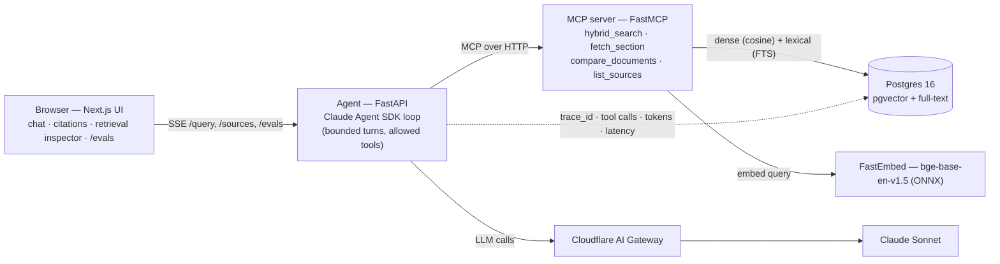

# Health-Docs Agent

> An **agentic, grounded Q&A** system over a small corpus of public digital-health documents —
> clinical-trial protocols, drug product labels, and clinical guidelines. It answers **only** from
> the ingested corpus, **cites the chunks it used**, and keeps a strict *not-medical-advice* posture.
> Built for the NewPage AI-Native Builder take-home (Option 1 — *Chat With Your Docs*).

It's a **multi-step, tool-calling agent**, not single-shot RAG: the agent plans, calls retrieval
tools over an MCP server, and composes a cited answer.

---

## Quick start

**Prerequisites:** Docker Desktop running. (No manual DB setup — Postgres + pgvector come up in a container and the schema is applied on first boot.)

```bash
cp .env.example .env     # set ANTHROPIC_API_KEY; optionally ANTHROPIC_BASE_URL (Cloudflare AI Gateway)
make up                  # builds & starts web :3000 · agent :8080 · mcp :8000 · postgres :5432
make seed                # ingest the documents in data/ (downloads the embedding model on first run)
```

Then open **http://localhost:3000** and ask, e.g. *"What are the contraindications for metformin?"*

```bash
make test                # pytest (mcp / agent / evals) + vitest (web)
make eval                # run the eval harness; results show at /evals
```

When `ANTHROPIC_BASE_URL` points at a Cloudflare AI Gateway, every model call is proxied through it
for caching, rate-limiting, spend caps and per-request logs; leave it unset to call the Anthropic API
directly. Embeddings always run locally, so they never need a key. On Windows without `make`, use
`docker compose up --build` then `docker compose exec mcp python -m ingest.seed data/`.

---

## Architecture overview



Four services, separated by responsibility:

- **`apps/web`** — Next.js 15 (App Router, TypeScript strict, Tailwind). Streaming chat over SSE, citation chips, a retrieval inspector (which tools ran, which chunks came back), a corpus sidebar with kind filters, upload, and an `/evals` dashboard.
- **`services/agent`** — FastAPI. Runs the **Claude Agent SDK** loop with a bounded `max_turns` and an explicit `allowed_tools` list; streams tokens + sources + tool events over SSE. Owns guardrails and observability. A simpler non-agentic RAG path is kept as a baseline and is what the evals score.
- **`services/mcp`** — a **FastMCP** server exposing the four retrieval tools. Owns ingestion + retrieval, and is deliberately standalone so it can be reused from Claude Code via `.mcp.json`.
- **Postgres 16 + pgvector** — dense vectors and lexical full-text in one store.

A query flows *UI → agent → (MCP) `hybrid_search` / `fetch_section` → Postgres → grounded, cited answer streamed back*, with the turn persisted for observability. A second Mermaid view of the query path is in [`ARCHITECTURE.md`](./ARCHITECTURE.md).

---

## Data model

Applied from [`services/mcp/db/schema.sql`](./services/mcp/db/schema.sql) on first boot.

```sql
documents(id, kind, title, source_uri, created_at)
  -- kind ∈ {trial, drug_label, guideline}; inferred at ingest from the filename

chunks(id, document_id → documents, section, ordinal, text, token_count,
       embedding vector(768),                 -- pgvector, HNSW (cosine)
       ts tsvector GENERATED from text,        -- Postgres full-text, GIN
       metadata jsonb)

messages(id, session_id, role, content, tool_calls jsonb, sources jsonb,
         trace_id, tokens_in, tokens_out, latency_ms, created_at)   -- observability

eval_runs(id, commit_sha, created_at)
eval_results(id, run_id → eval_runs, question, hit_at_k, mrr, ndcg, faithfulness, created_at)
```

Two indexes back hybrid retrieval: an **HNSW** index on `embedding` (`vector_cosine_ops`) for the dense arm and a **GIN** index on `ts` for the lexical arm.

---

## RAG / LLM approach & decisions

- **Chunking — structure-aware.** I split on document section headings (Markdown / numbered / ALL-CAPS), then slide a ~512-token window with ~12% overlap. Clinical docs are heavily sectioned — *Contraindications*, *Eligibility Criteria*, *Use in Specific Populations* — so chunking on those boundaries keeps an answer and its citation tied to a unit a clinician would recognise, rather than an arbitrary 500-token slice.
- **Embedding model — `BAAI/bge-base-en-v1.5` via FastEmbed (ONNX), 768-dim, local.** I considered a hosted embedding API (OpenAI / Voyage) but chose local: no key, no per-token cost, deterministic, private, and light enough (ONNX, not torch) to run in the container. A hosted model might edge it out on a benchmark, but for this corpus the recall was already strong and the cost/operational simplicity won.
- **Retrieval — hybrid, dense + lexical.** Dense (pgvector cosine) catches paraphrase; lexical (Postgres full-text) catches exact drug names, codes and dosages that embeddings blur. I fuse the two with **Reciprocal Rank Fusion** because it needs no score calibration between arms. Pure-dense was the obvious baseline; it missed exact-term queries, which is why I kept both.
- **Vector database — Postgres + pgvector.** I considered a dedicated vector DB (Pinecone / Weaviate / Cloudflare Vectorize) but didn't want a second datastore for a corpus this size. Postgres holds the vectors, the full-text index, *and* the app's own tables, and it ports straight to managed Postgres in production.
- **Orchestration — Claude Agent SDK + FastMCP, hand-rolled (no LangChain).** The loop is small enough to own and bound (`max_turns`, `allowed_tools`), which I value more than a framework's abstractions here. Keeping the tools behind MCP also means they're reusable outside the app and testable on their own.
- **Prompt & context management.** Only retrieved chunks enter the context window, never whole documents. The system prompt mandates grounded-only answers with citations and frames retrieved text as **data, not instructions**.

---

## Guardrails, quality & observability

- **Grounded-only + citations.** Every answer carries the chunk ids it used; if the corpus doesn't support an answer, the agent says so rather than guessing.
- **Not medical advice.** A standing disclaimer posture; out-of-scope clinical/diagnostic requests are refused.
- **Prompt-injection defense.** Document text is explicitly treated as untrusted data in the system prompt — it can't redirect the agent.
- **Observability.** `structlog` JSON logs, a `trace_id` threaded through every turn and tool call, OpenTelemetry spans, and every turn persisted to `messages` (tool calls, sources, token counts, latency). The UI's retrieval inspector surfaces the same trail.
- **Quality** is gated by evals (below).

---

## Evals

`make eval` scores a golden set ([`evals/dataset/sample.jsonl`](./evals/dataset/sample.jsonl)) on
**retrieval** (hit@k, MRR, nDCG against labelled chunk ids) and **answer faithfulness** (an LLM judge
grading whether each claim is supported by the retrieved context). Results persist to the DB and
render at **`/evals`**; CI gates on `hit@5 ≥ 0.7` and `faithfulness ≥ 0.8`.

Latest run on the bundled 8-document corpus:

| Metric | Score |
|---|---|
| hit@5 | **1.00** |
| MRR | **1.00** |
| nDCG | **0.873** |
| Faithfulness (LLM judge) | **0.67** |

Retrieval is solid; one of three answers slips under the strict 0.8 faithfulness bar — an honest signal that the *answer-composition* prompt needs work, not retrieval. (Fixture chunk ids assume a fresh seed of the committed corpus; ids are assigned deterministically in file order, so they reproduce after `docker compose down -v` → `up` → seed.)

---

## Key technical decisions

- **MCP as the tool boundary**, not inline functions — so retrieval is reusable (from Claude Code or another agent) and unit-testable on its own.
- **Hybrid + RRF instead of a reranker** for the time-box: most of the recall benefit without the extra model and latency. The reranker is the first thing I'd add next.
- **Postgres for everything** to keep the moving parts down; pgvector + full-text cover both retrieval arms.
- **A non-agentic baseline kept alongside the agent loop**, so I can measure retrieval/answer quality independently of how well the agent plans.
- **LLM calls behind the Cloudflare AI Gateway** so caching, spend caps and logging are a config flag, not a code change.

---

## Engineering standards I followed (and skipped)

**Followed:** tests written alongside the code, full typing (`mypy`, TS `strict`), `ruff` / `eslint`, conventional commits, small single-responsibility modules, 12-factor config from env, containerised with `docker compose`, and the eval gate wired into CI.

**Skipped on purpose, given the time-box:** authn/authz and multi-tenancy, a reranking stage, rich PDF/OCR ingestion (I kept to text/Markdown + simple PDF), exhaustive edge-case handling, and production secrets management. I'd rather call these out than pretend they're done.

---

## Productionising on a hyper-scaler

To take this from a local stack to something scalable on AWS / GCP / Azure / Cloudflare:

- **Data:** managed Postgres + pgvector (RDS / Cloud SQL / Supabase) with connection pooling (PgBouncer or Cloudflare Hyperdrive), read replicas, tuned HNSW parameters, and a re-embedding job when the embedding model changes.
- **Compute:** containerise `mcp` + `agent` on Cloud Run / ECS Fargate / Cloudflare Containers behind autoscaling; serve the web tier from Vercel or Cloudflare Pages; move the embedder to a warm service or a batch step so it isn't on the request path cold.
- **LLM:** keep the Cloudflare AI Gateway in front for caching, rate-limits, spend caps and request logs, and add a provider fallback.
- **Ingestion:** an async queue for large corpora, with versioned re-embedding.
- **Security/compliance:** a secrets manager, audit logging, and — if real PHI is ever involved — a HIPAA/GDPR posture, data-residency controls, and a no-train guarantee on the model provider.

---

## How I used AI tools

I built this with **Claude Code** as the main coding agent, but treated it like a junior engineer on a tight leash, not an autocomplete. The contract lives in a committed `CLAUDE.md`: TDD, small conventional-commit diffs, no heavy frameworks (so it doesn't reach for LangChain), keep retrieval behind the MCP server so it stays reusable and testable, and — deliberately — don't let the agent write the README's reasoning. I drove it in phases (see `PLAN.md`) and reviewed diffs as they landed.

What earned its keep was refusing to trust a green build. Unit tests and `next build` passed while two real bugs hid underneath: the web UI couldn't reach the API (missing CORS), and the dense-retrieval query passed the embedding as a `double precision[]` instead of casting to `vector`, so `hybrid_search` only "worked" because the agent quietly fell back to other tools. Both surfaced only when I ran the whole thing end-to-end and read the eval output rather than the test summary.

So my do's and don'ts with AI coding tools: **do** put the conventions in a checked-in contract the agent has to follow, keep tools behind a small, testable boundary, and lean on evals + real runtime to catch what mocks and builds paper over. **Don't** equate "tests pass" with "works", and don't let the agent invent architecture or make the judgement calls — those stay with me. Keeping the MCP server standalone (usable from Claude Code via `.mcp.json`) is what makes the setup repeatable across sessions.

---

## What I'd do next

With more time I'd add a cross-encoder reranker after the hybrid fusion — that's the biggest likely quality win — and highlight citations inline in a source pane instead of just chips. I'd grow the eval set into a larger, human-labelled one so faithfulness is measured on more than a handful of questions, and tune the answer-composition prompt: retrieval is already at hit@5 1.0, so the faithfulness gap is in *how* answers are written, not *what's* retrieved. Past a demo corpus I'd move to managed Postgres with queue-based ingestion, add per-document access control, and handle richer PDFs and tables.

---

## Known limitations

- Small demo corpus (8 public docs); not tuned for scale.
- Text/Markdown + basic PDF ingestion only — no OCR or complex table extraction.
- Single-user, no auth.
- Faithfulness depends on an LLM judge and a strict threshold; treat the score as directional.

---

## Project structure

```
apps/web            Next.js UI (chat, citations, retrieval inspector, /evals)
services/agent      FastAPI + Claude Agent SDK loop, guardrails, observability
services/mcp        FastMCP server: retrieval tools + ingestion (chunk / embed / seed)
evals               golden set + metrics (hit@k, MRR, nDCG, faithfulness) + runner
data                public, non-PII seed corpus (+ provenance in data/README.md)
```

---

## Disclaimer

This project answers from public documents for demonstration only. It is **not medical advice**.
