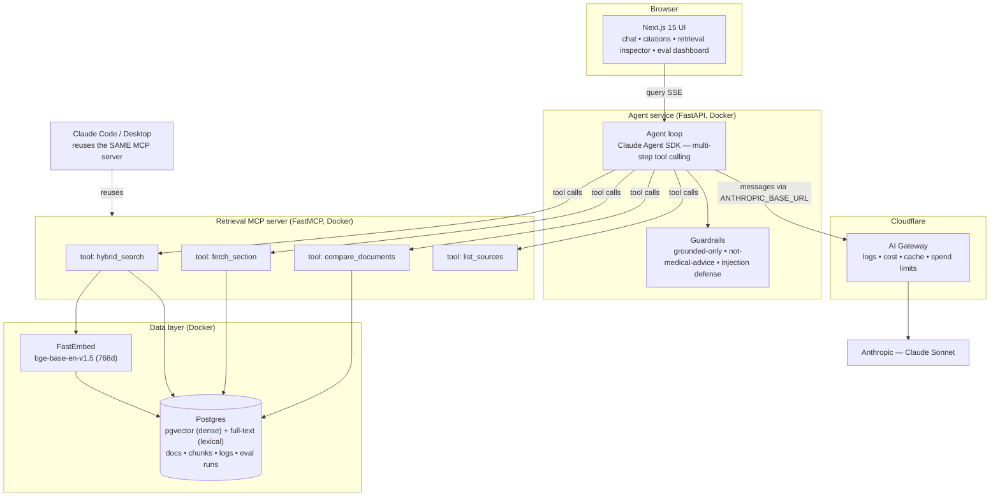

# Health-Docs Agent

> Agentic, grounded Q&A over a small corpus of public digital-health documents
> (clinical-trial protocols, drug product information, clinical guidelines).
> Built for the NewPage AI-Native Builder assignment.

<!-- TODO: 20-30s demo gif -->

## Quick start
```bash
cp .env.example .env        # fill ANTHROPIC_API_KEY + AI Gateway base URL (see SETUP.md)
make up                     # web :3000 - agent :8080 - mcp :8000 - postgres :5432
make seed                   # ingest the corpus in data/
make test                   # pytest + vitest
make eval                   # run the eval harness
```

## Architecture
See [ARCHITECTURE.md](ARCHITECTURE.md) for the full diagrams (system + query path) and component flow.


<!-- YOUR WORDS HERE: a few sentences framing the diagram (agent-vs-RAG, the reusable MCP server, hybrid retrieval). -->


## RAG / agent approach & decisions
<!-- YOUR WORDS HERE - chunking, embeddings, hybrid retrieval (BM25 + dense + RRF), the agent loop,
     MCP tools, prompt & context engineering, guardrails, evals, observability.
     For each: what you considered, what you chose, and why. Do NOT let an LLM write this section. -->

## Key technical decisions
<!-- YOUR WORDS HERE -->

## Engineering standards I followed (and ones I skipped)
<!-- YOUR WORDS HERE - TDD, typing, containerisation, CI; and what you consciously skipped for the time-box and why -->

## How I used AI tools
<!-- YOUR WORDS HERE - your Claude Code workflow, CLAUDE.md, sub-agents, skills, the reusable MCP server,
     do's and don'ts. Connect it to your Microns Hub work (custom MCP server, tiered model routing, RAG,
     agentic RFQ/email intake) - that is the forward-deployed, founder's-mindset profile they describe. -->

## Productionising on Cloudflare (and alternatives)
<!-- YOUR WORDS HERE - Pages + Containers + Vectorize + D1 + R2; acknowledge AWS / K8s / Elasticsearch.
     Frame as "chosen for fit, not preference". -->

## Evals
<!-- TODO: how to read the /evals dashboard + the metrics; YOUR WORDS on methodology -->

## What I'd do next with more time
<!-- YOUR WORDS HERE -->

## Known limitations
<!-- YOUR WORDS HERE -->

## Disclaimer
This is general information extracted from public documents. It is **not medical advice**.
