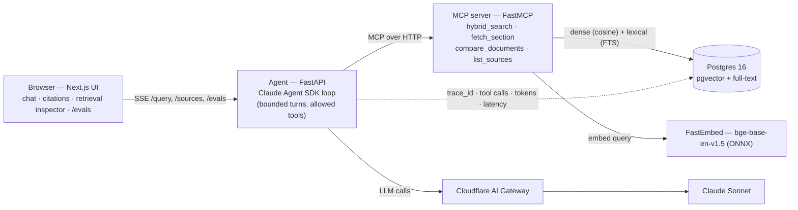

<!--
  NOTE TO SELF (delete before submitting): the sections tagged "✍️" are a starting draft.
  The brief explicitly wants YOUR thinking, not an LLM's — rewrite the decision-reasoning and
  "How I used AI tools" sections in your own voice.
-->

# Health-Docs Agent

> An **agentic, grounded Q&A** system over a small corpus of public digital-health documents —
> clinical-trial protocols, drug product labels, and clinical guidelines. It answers **only** from
> the ingested corpus, **cites the chunks it used**, and keeps a strict *not-medical-advice* posture.
> Built for the NewPage AI-Native Builder take-home (Option 1 — *Chat With Your Docs*).

It is a **multi-step, tool-calling agent**, not single-shot RAG: the agent plans, calls retrieval
tools over an MCP server, and composes a cited answer.

---

## Quick start

**Prerequisites:** Docker Desktop running. (No manual DB setup — Postgres + pgvector come up in a container and the schema is applied on first boot.)

```bash
cp .env.example .env     # set ANTHROPIC_API_KEY; optionally ANTHROPIC_BASE_URL (Cloudflare AI Gateway)
make up                  # builds & starts web :3000 · agent :8080 · mcp :8000 · postgres :5432
make seed                # ingest the documents in data/ (downloads the embedding model on first run)
```

Then open **http://localhost:3000** and ask, e.g. *"What are the contraindications for metformin?"*

```bash
make test                # pytest (mcp / agent / evals) + vitest (web)
make eval                # run the eval harness; results show at /evals
```

> **LLM routing.** When `ANTHROPIC_BASE_URL` points at a Cloudflare AI Gateway, every model call is
> proxied through it for caching, rate-limiting, spend caps and per-request logs. Leave it unset to
> call the Anthropic API directly. Embeddings always run locally, so no key is needed for those.

On Windows without `make`, the equivalents are `docker compose up --build`, then
`docker compose exec mcp python -m ingest.seed data/`.

---

## Architecture



Four services, separated by responsibility:

- **`apps/web`** — Next.js 15 (App Router, TypeScript strict, Tailwind). Streaming chat over SSE, citation chips, a retrieval inspector (which tools ran, which chunks came back), corpus sidebar with kind filters, upload, and an `/evals` dashboard.
- **`services/agent`** — FastAPI. Runs the **Claude Agent SDK** loop with a bounded `max_turns` and an explicit `allowed_tools` list; streams tokens + sources + tool events over SSE. Owns guardrails and observability. A simpler non-agentic RAG path is kept as a baseline and is what the evals score.
- **`services/mcp`** — a **FastMCP** server exposing the four retrieval tools. Owns ingestion + retrieval, and is deliberately standalone so it can be reused from Claude Code via `.mcp.json`.
- **Postgres 16 + pgvector** — dense vectors and lexical full-text in one store.

A query path: *UI → agent → (MCP) `hybrid_search` / `fetch_section` → Postgres → grounded, cited answer streamed back, with the turn persisted for observability.* A second Mermaid view of the query path lives in [`ARCHITECTURE.md`](./ARCHITECTURE.md).

---

## Data model

The schema is applied from [`services/mcp/db/schema.sql`](./services/mcp/db/schema.sql) on first boot.

```sql
documents(id, kind, title, source_uri, created_at)
  -- kind ∈ {trial, drug_label, guideline}; inferred at ingest from the filename

chunks(id, document_id → documents, section, ordinal, text, token_count,
       embedding vector(768),                 -- pgvector, HNSW (cosine)
       ts tsvector GENERATED from text,        -- Postgres full-text, GIN
       metadata jsonb)

messages(id, session_id, role, content, tool_calls jsonb, sources jsonb,
         trace_id, tokens_in, tokens_out, latency_ms, created_at)   -- observability

eval_runs(id, commit_sha, created_at)
eval_results(id, run_id → eval_runs, question, hit_at_k, mrr, ndcg, faithfulness, created_at)
```

Two indexes back hybrid retrieval: an **HNSW** index on `embedding` (`vector_cosine_ops`) for the dense arm and a **GIN** index on `ts` for the lexical arm.

---

## RAG / agent approach & decisions

> ✍️ _Draft grounded in the implementation — revise the "why" in your own words._

- **Chunking — structure-aware.** Split on document section headings (Markdown / numbered / ALL-CAPS), then slide a ~512-token window with ~12% overlap. Clinical docs are highly sectioned (Contraindications, Eligibility Criteria, Use in Specific Populations), so section-aware chunks keep an answer and its citation tied to a meaningful unit.
- **Embeddings — `BAAI/bge-base-en-v1.5` via FastEmbed (ONNX), 768-dim, local.** No API key, no per-token cost, deterministic, and light enough to run in the container (ONNX, not torch). Trade-off: a hosted embedding API might score marginally higher on some benchmarks, but local keeps the loop cheap and private.
- **Retrieval — hybrid.** Dense (pgvector cosine) **and** lexical (Postgres full-text) candidates fused with **Reciprocal Rank Fusion**. Pure-dense misses exact drug names / codes; lexical alone misses paraphrase. RRF needs no score calibration between the two arms.
- **Vector store — Postgres + pgvector.** One store for dense + lexical + the app's own tables; no extra moving part vs. a dedicated vector DB (Pinecone / Weaviate / Vectorize), and trivially portable to managed Postgres.
- **Orchestration — Claude Agent SDK + FastMCP, hand-rolled.** No LangChain: the loop is small enough to own, easy to reason about and to bound (`max_turns`, `allowed_tools`), and the MCP tools stay reusable outside the app.
- **Prompt & context management.** The system prompt enforces grounded-only answers, mandatory citations, and treats retrieved text as **data, not instructions**. Only retrieved chunks (not whole documents) enter the context window.

---

## Guardrails, quality & observability

- **Grounded-only + citations.** Every answer carries the chunk ids it used; if the corpus doesn't support an answer, the agent says so rather than guessing.
- **Not medical advice.** A standing disclaimer posture; out-of-scope clinical/diagnostic requests are refused.
- **Prompt-injection defense.** Document text is explicitly framed as untrusted data in the system prompt.
- **Observability.** `structlog` JSON logs, a `trace_id` threaded through every turn and tool call, OpenTelemetry spans, and every turn persisted to `messages` (tool calls, sources, token counts, latency). The retrieval inspector surfaces the same trail in the UI.
- **Evals as a first-class gate** (below).

---

## Evals

`make eval` scores a golden set ([`evals/dataset/sample.jsonl`](./evals/dataset/sample.jsonl)) on
**retrieval** (hit@k, MRR, nDCG against labelled chunk ids) and **answer faithfulness** (an LLM judge
grading whether each claim is supported by the retrieved context). Results persist to the DB and
render at **`/evals`**; CI gates on `hit@5 ≥ 0.7` and `faithfulness ≥ 0.8`.

Latest run on the bundled 8-document corpus:

| Metric | Score |
|---|---|
| hit@5 | **1.00** |
| MRR | **1.00** |
| nDCG | **0.873** |
| Faithfulness (LLM judge) | **0.67** |

Retrieval is strong; one of three answers falls under the strict 0.8 faithfulness bar — an honest signal that the answer-composition prompt has room to improve, not a retrieval problem.

> Fixture chunk ids assume a fresh seed of the committed corpus (ids are assigned deterministically in file order, so they reproduce after `docker compose down -v` → `up` → seed).

---

## Key technical decisions

> ✍️ _Draft — make this yours._

- **MCP as the tool boundary**, not inline functions, so retrieval is reusable (from Claude Code, other agents) and independently testable.
- **Hybrid + RRF over a reranker** for the time-box: most of the recall benefit, none of the extra model/latency.
- **Postgres for everything** to minimise infra; pgvector + full-text cover both retrieval arms.
- **A non-agentic baseline kept alongside the agent loop** so retrieval/answer quality is measurable independently of agent planning.

---

## Engineering standards I followed (and skipped)

**Followed:** tests alongside changes, full typing (`mypy`, TS `strict`), `ruff` / `eslint`, conventional commits, small single-responsibility modules, 12-factor config from env, containerised with `docker compose`, and an eval gate wired into CI.

**Skipped, consciously, for the time-box:** authn/authz and multi-tenancy; a reranking stage; rich PDF/OCR ingestion (kept to text/Markdown + simple PDF); exhaustive edge-case handling; production secrets management. Called out here rather than hidden.

---

## Productionising on a hyper-scaler

> ✍️ _Draft — frame in your own words; "chosen for fit, not preference."_

- **Data:** managed Postgres + pgvector (RDS / Cloud SQL / Supabase); connection pooling (PgBouncer / Cloudflare Hyperdrive); read replicas; tuned HNSW params; a re-embedding job when the model changes.
- **Compute:** containerise `mcp` + `agent` on Cloud Run / ECS Fargate / Cloudflare Containers behind autoscaling; web tier on Vercel or Cloudflare Pages; move the embedder to a warm service or batch step.
- **LLM:** keep the **Cloudflare AI Gateway** in front for caching, rate-limits, spend caps and request logs; add provider fallback.
- **Ingestion:** an async queue for large corpora, with versioned re-embedding.
- **Security/compliance:** secrets manager, audit logging, and — if real PHI is ever involved — a HIPAA/GDPR posture, data-residency controls, and no-train guarantees.

---

## How I used AI tools

> ✍️ **Write this one yourself — it's the section the brief cares about most.**
> Starting facts you can build on: built with **Claude Code** as the primary coding agent under a
> committed **`CLAUDE.md`** operating contract (TDD, small diffs, no heavy frameworks, MCP kept
> standalone and reusable). Add *your* workflow — how you steered and reviewed the agent, what you
> rewrote by hand, your do's & don'ts, and how you keep AI-assisted work repeatable and maintainable.

---

## What I'd do next with more time

> ✍️ _Your call — candidates:_ a cross-encoder reranker; citations highlighted inline in the source
> pane; per-document access control; richer PDF/table ingestion; a larger human-labelled eval set;
> and answer-prompt tuning to lift faithfulness past the gate.

---

## Known limitations

- Small demo corpus (8 public docs); not tuned for scale.
- Text/Markdown + basic PDF ingestion only — no OCR or complex table extraction.
- Single-user, no auth.
- Faithfulness depends on an LLM judge and a strict threshold; treat scores as directional.

---

## Project structure

```
apps/web            Next.js UI (chat, citations, retrieval inspector, /evals)
services/agent      FastAPI + Claude Agent SDK loop, guardrails, observability
services/mcp        FastMCP server: retrieval tools + ingestion (chunk / embed / seed)
evals               golden set + metrics (hit@k, MRR, nDCG, faithfulness) + runner
data                public, non-PII seed corpus (+ provenance in data/README.md)
```

---

## Disclaimer

This project answers from public documents for demonstration only. It is **not medical advice**.
